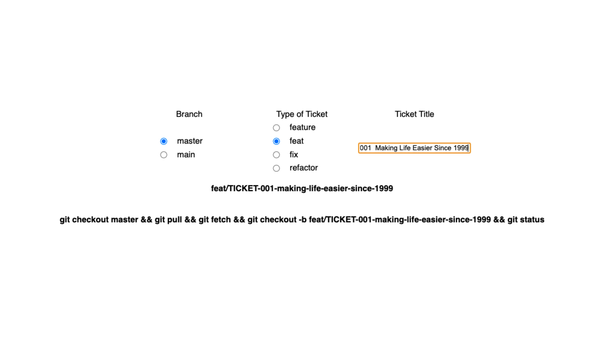

# ticket-generator

Generate your atlassian tickets as branches using this simple generator

## How to use

### All you need to do is copy the `ticket title` + `ticket id` from jira directly and paste it here

(it's doing the split on `ID` & `Title` by two spaces that's what you get after you copy from jira)

### To copy the git command all you need to do is click on it! The copy now is done automagically

### Result

